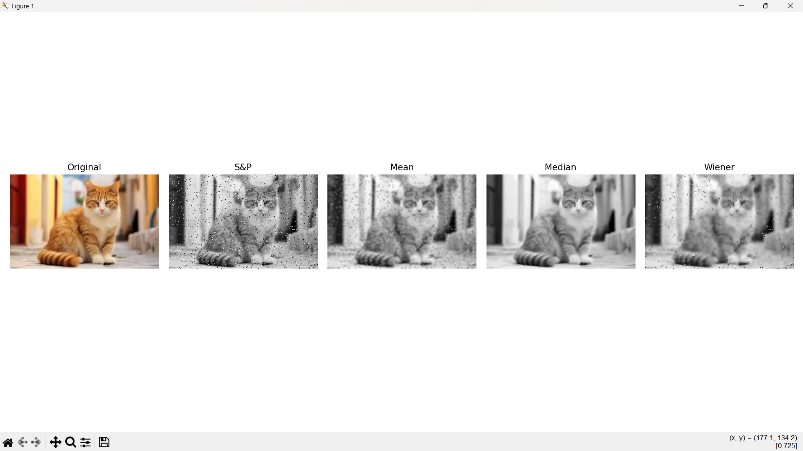
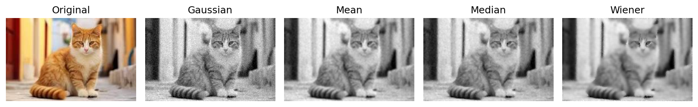

# Program 7: Filter Performance Comparison on Noisy Images

## Question
Compare the performance of these filters on noisy images in terms of restoration quality.

## Aim
To compare and evaluate the performance of different noise reduction filters (mean, median, and Wiener filters) on images corrupted with Gaussian noise and salt-and-pepper noise, assessing their restoration quality.

## Algorithm

**Step 1**: Load image in color and convert to grayscale
   - Read color image: `img_color = cv2.imread(path)`
   - Convert BGR to RGB: `img_color_rgb = cv2.cvtColor(img_color, cv2.COLOR_BGR2RGB)`
   - Convert to grayscale for processing: `img = cv2.cvtColor(img_color, cv2.COLOR_BGR2GRAY)`
   - Normalize to [0, 1] range: `img = img.astype(float32) / 255.0`

**Step 2**: Add Gaussian noise
   - Generate random noise: `noise = 0.05 * randn(image_shape)`
   - Add to image and clip: `gaussian = clip(img + noise, 0, 1)`

**Step 3**: Add salt-and-pepper noise
   - Copy original image: `sp = img.copy()`
   - Generate random matrix: `rand = random(image_shape)`
   - Set pixels to 0 (pepper) where `rand < prob/2`
   - Set pixels to 1 (salt) where `rand > 1 - prob/2`
   - Probability `prob = 0.05`

**Step 4**: Apply filters to Gaussian noisy image
   - Mean filter: `mean_gauss = blur(gaussian, (3, 3))`
   - Median filter: `median_gauss = medianBlur(gaussian*255, 3) / 255`
   - Wiener filter: `wiener_gauss = wiener(gaussian, (5, 5))`

**Step 5**: Apply filters to salt-and-pepper noisy image
   - Mean filter: `mean_sp = blur(sp, (3, 3))`
   - Median filter: `median_sp = medianBlur(sp*255, 3) / 255`
   - Wiener filter: `wiener_sp = wiener(sp, (5, 5))`

**Step 6**: Display results
   - Create two figure layouts (1×5 subplots each)
   - First figure: Original (color), Gaussian noisy, and filtered results (grayscale)
   - Second figure: Original (color), Salt-and-pepper noisy, and filtered results (grayscale)
   - Display original image in color, filtered results in grayscale colormap

## Program Logic

1. **Image Loading**: 
   - Load the image in color format (BGR)
   - Convert BGR to RGB for proper display
   - Convert to grayscale for noise addition and filtering operations
   - Normalize pixel values to the range [0, 1] for consistent processing

2. **Gaussian Noise Generation**:
   - Add random noise sampled from a Gaussian distribution with standard deviation 0.05
   - Clip resulting values to ensure they remain in valid [0, 1] range
   - Gaussian noise affects all pixels uniformly with random intensity variations

3. **Salt-and-Pepper Noise Generation**:
   - Randomly corrupt 5% of pixels (2.5% salt, 2.5% pepper)
   - Salt noise sets pixels to maximum intensity (1.0)
   - Pepper noise sets pixels to minimum intensity (0.0)
   - This creates impulse noise with extreme pixel values

4. **Filter Application**:
   - **Mean Filter**: Uses 3×3 averaging kernel to smooth the image
   - **Median Filter**: Replaces each pixel with the median of its 3×3 neighborhood (effective for impulse noise)
   - **Wiener Filter**: Adaptive filter that estimates local statistics and performs optimal filtering

5. **Performance Comparison**:
   - Apply all three filters to both noise types
   - Visual comparison allows assessment of:
     - Noise reduction effectiveness
     - Edge preservation capability
     - Artifact introduction
     - Overall restoration quality

6. **Visualization**: 
   - Display original image in color for reference
   - Display noisy and filtered images in grayscale for comparison
   - Two separate figures: one for Gaussian noise results, one for salt-and-pepper noise results
   - Side-by-side layout (1×5 subplots) for easy visual comparison

## Code

```python
import cv2
import numpy as np
from scipy.signal import wiener
import matplotlib.pyplot as plt
import os

# Load image
img_color = cv2.imread('../assets/cat.jpg')
img_color_rgb = cv2.cvtColor(img_color, cv2.COLOR_BGR2RGB)
img = cv2.cvtColor(img_color, cv2.COLOR_BGR2GRAY).astype(np.float32) / 255.0

# Add Gaussian noise
gaussian = np.clip(img + 0.05 * np.random.randn(*img.shape), 0, 1)

# Add salt-and-pepper noise
sp = img.copy()
prob = 0.05
rand = np.random.rand(*img.shape)
sp[rand < prob/2] = 0
sp[rand > 1 - prob/2] = 1

# Filters for Gaussian noise
mean_gauss = cv2.blur(gaussian, (3, 3))
median_gauss = cv2.medianBlur((gaussian*255).astype(np.uint8), 3) / 255.0
wiener_gauss = wiener(gaussian, (5, 5))

# Filters for Salt-and-Pepper noise
mean_sp = cv2.blur(sp, (3, 3))
median_sp = cv2.medianBlur((sp*255).astype(np.uint8), 3) / 255.0
wiener_sp = wiener(sp, (5, 5))

# Show Gaussian noise results
plt.figure(figsize=(12, 4))
titles = ["Original", "Gaussian", "Mean", "Median", "Wiener"]
images = [img_color_rgb, gaussian, mean_gauss, median_gauss, wiener_gauss]
for i in range(5):
    plt.subplot(1, 5, i+1)
    if i == 0:
        plt.imshow(images[i])
    else:
        plt.imshow(images[i], cmap='gray')
    plt.title(titles[i])
    plt.axis('off')
plt.tight_layout()
plt.show()

# Show Salt-and-Pepper noise results
plt.figure(figsize=(12, 4))
titles2 = ["Original", "S&P", "Mean", "Median", "Wiener"]
images2 = [img_color_rgb, sp, mean_sp, median_sp, wiener_sp]
for i in range(5):
    plt.subplot(1, 5, i+1)
    if i == 0:
        plt.imshow(images2[i])
    else:
        plt.imshow(images2[i], cmap='gray')
    plt.title(titles2[i])
    plt.axis('off')
plt.tight_layout()
plt.show()
```

## Output





