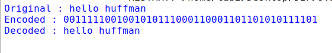

# Program 9: Lossless Compression (Huffman Coding)

## Question
Implement lossless compression techniques (e.g., Huffman coding) and lossy compression techniques (e.g., JPEG compression) using Python.

## Aim
To implement Huffman coding, a lossless compression algorithm that assigns variable-length binary codes to characters based on their frequency, ensuring more frequent characters have shorter codes.

## Algorithm

**Step 1**: Build Huffman Tree
   - Count frequency of each character in input text
   - Create leaf node for each unique character with its frequency
   - Build min-heap (priority queue) from leaf nodes

**Step 2**: Construct tree by merging nodes
   - While heap has more than one node:
     - Extract two nodes with minimum frequency: `node1 = heappop(heap)`, `node2 = heappop(heap)`
     - Create internal node with frequency = `node1.freq + node2.freq`
     - Set `node1` as left child, `node2` as right child
     - Insert merged node back into heap
   - Root of tree is the remaining node in heap

**Step 3**: Generate Huffman codes
   - Traverse tree recursively starting from root
   - For left child: append '0' to current code
   - For right child: append '1' to current code
   - When leaf node reached: store `codes[character] = current_code`
   - Return dictionary mapping characters to binary codes

**Step 4**: Encode text
   - For each character in input text:
     - Lookup its Huffman code from dictionary
     - Append code to encoded string
   - Return complete binary encoded string

**Step 5**: Decode binary string
   - Start at root of Huffman tree
   - For each bit in encoded string:
     - If bit is '0': move to left child
     - If bit is '1': move to right child
     - If current node is leaf: append character to output, reset to root
   - Return decoded text

## Program Logic

1. **Node Class**: 
   - Represents a node in the Huffman tree
   - Stores character, frequency, and left/right child nodes
   - Implements comparison for priority queue operations

2. **Tree Construction (`make_tree`)**:
   - Count frequency of each character in the input text
   - Create a min-heap (priority queue) of nodes
   - Repeatedly merge two nodes with lowest frequencies until one root node remains
   - The resulting tree structure minimizes average code length

3. **Code Generation (`make_code`)**:
   - Traverse the Huffman tree recursively
   - Assign '0' for left child, '1' for right child
   - Store character-to-code mappings in a dictionary
   - More frequent characters get shorter codes

4. **Encoding (`encode`)**:
   - Replace each character in the text with its corresponding Huffman code
   - Concatenate all codes to form the compressed binary string

5. **Decoding (`decode`)**:
   - Traverse the tree following the binary string
   - Move left for '0', right for '1'
   - When a leaf node is reached, output the character and reset to root
   - Continue until entire encoded string is processed

6. **Lossless Property**: The original text can be perfectly reconstructed from the encoded string using the tree structure.

## Code

```python
from collections import Counter
import heapq

class Node:
    """Node class for Huffman tree construction"""
    def __init__(self, char, freq, left=None, right=None):
        self.char = char
        self.freq = freq
        self.left = left
        self.right = right
    
    def __lt__(self, other):
        return self.freq < other.freq

def make_tree(text):
    """
    Build Huffman tree from input text.
    Args:
        text: Input string to compress
    Returns:
        Root node of Huffman tree
    """
    freq = Counter(text)
    heap = [Node(c, f) for c, f in freq.items()]
    heapq.heapify(heap)
    
    while len(heap) > 1:
        a = heapq.heappop(heap)
        b = heapq.heappop(heap)
        merged = Node(None, a.freq + b.freq, a, b)
        heapq.heappush(heap, merged)
    
    return heap[0]

def make_code(node, code="", codes=None):
    """
    Generate Huffman codes by traversing the tree.
    Args:
        node: Current node in tree
        code: Current code string
        codes: Dictionary to store codes
    Returns:
        Dictionary mapping characters to their Huffman codes
    """
    if codes is None:
        codes = {}
    
    if node.char is not None:
        codes[node.char] = code
    else:
        make_code(node.left, code + "0", codes)
        make_code(node.right, code + "1", codes)
    
    return codes

def encode(text, codes):
    """
    Encode text using Huffman codes.
    Args:
        text: Input text to encode
        codes: Dictionary of character to code mappings
    Returns:
        Encoded binary string
    """
    return "".join(codes[c] for c in text)

def decode(encoded, tree):
    """
    Decode binary string using Huffman tree.
    Args:
        encoded: Encoded binary string
        tree: Root node of Huffman tree
    Returns:
        Decoded original text
    """
    node = tree
    out = ""
    for bit in encoded:
        node = node.left if bit == "0" else node.right
        if node.char is not None:
            out += node.char
            node = tree
    return out

# Example usage
text = "hello huffman"
tree = make_tree(text)
codes = make_code(tree)
encoded = encode(text, codes)
decoded = decode(encoded, tree)

print("Original :", text)
print("Encoded :", encoded)
print("Decoded :", decoded)
```

## Output



